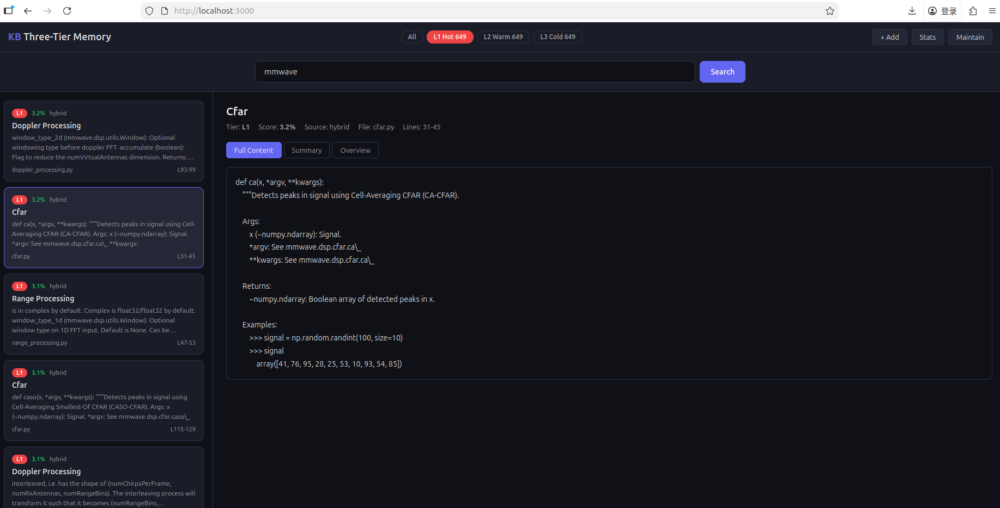

# Personal Knowledge Base - User Manual



## Three-Tier Memory System with Intelligent Deduplication

Version 1.0.0

---

## Table of Contents

1. [System Overview](#1-system-overview)
2. [Installation](#2-installation)
3. [Quick Start](#3-quick-start)
4. [CLI Reference](#4-cli-reference)
5. [Web Interface](#5-web-interface)
6. [Architecture Details](#6-architecture-details)
7. [Configuration](#7-configuration)
8. [Ollama Integration](#8-ollama-integration)
9. [FAQ & Troubleshooting](#9-faq--troubleshooting)

---

## 1. System Overview

This is a fully local, privacy-first personal knowledge base that:

- Ingests documents (Markdown, Python, JavaScript, JSON, YAML, plain text, etc.)
- Splits them into intelligent chunks (by heading, by function, or sliding window)
- Generates embeddings for semantic search (via Ollama or built-in fallback)
- Stores everything in a single SQLite database
- Provides hybrid search: vector similarity + full-text (FTS5) + RRF fusion
- Manages memory in three tiers: L1 (hot), L2 (warm), L3 (cold)
- Detects duplicates using SimHash, semantic hashing, and vector similarity
- Offers both CLI and Web UI interfaces

### Three-Tier Memory Model

| Tier | Name | Description | Retention |
|------|------|-------------|-----------|
| L1 | Working Memory | Full content, full vectors, frequently accessed | 7 days (default) |
| L2 | Short-term Memory | Compressed summaries, full vectors | 30 days (default) |
| L3 | Long-term Memory | Overviews only, quantized vectors, archived content | 365 days |

Content automatically moves from L1 -> L2 -> L3 based on access patterns. Accessing cold data promotes it back to L1.

---

## 2. Installation

### Requirements

- Python 3.10+
- (Optional) Ollama for AI-powered embeddings and summarization

### Setup

```bash
# 1. Install Python dependencies
pip install -r requirements.txt

# 2. Initialize the knowledge base
python main.py init

# 3. (Optional) Install and start Ollama for AI features
# See: https://ollama.ai
# ollama pull nomic-embed-text
# ollama pull phi3:mini
```

### Files Created

After initialization:
- `kb.db` - SQLite database (all metadata, chunks, vectors)
- `config.yaml` - Configuration file
- `files/` - Directory for uploaded files (via web UI)
- `archives/` - Compressed L3 archives

---

## 3. Quick Start

### Add Documents

```bash
# Add a single file
python main.py add ./my_notes.md

# Add with tags
python main.py add ./paper.md --tags "deep-learning,transformers"

# Add with a custom title
python main.py add ./code.py --title "My Utility Functions"

# Add an entire directory (recursive by default)
python main.py add ./my-documents/
```

### Search

```bash
# Natural language search
python main.py search "how does attention mechanism work"

# Limit results
python main.py search "python decorators" --top 5

# Search specific tier
python main.py search "neural networks" --tier 1

# Filter by tag
python main.py search "optimization" --filter "deep-learning"
```

### Web Interface

```bash
# Start the web server (default port 3000)
python main.py serve

# Custom port
python main.py serve --port 8080
```

Then open http://localhost:3000 in your browser.

---

## 4. CLI Reference

All commands follow the pattern:

```
python main.py [--db DB_PATH] [--config CONFIG_PATH] COMMAND [OPTIONS]
```

Global options must come before the command name.

### Commands

#### `init` - Initialize Knowledge Base

```bash
python main.py init
python main.py --db ./custom.db init
```

Creates the database and default config file if they don't exist.

#### `add` - Add File or Directory

```bash
python main.py add <path> [--tags TAG1,TAG2] [--title TITLE] [-r]
```

| Option | Description |
|--------|-------------|
| `path` | File or directory path (required) |
| `--tags` | Comma-separated tags |
| `--title` | Custom document title |
| `-r, --recursive` | Recurse into subdirectories (default: true) |

Supported file types: `.md`, `.txt`, `.py`, `.js`, `.ts`, `.json`, `.yaml`, `.yml`, `.toml`, `.sql`, `.sh`, `.css`, `.html`, `.xml`, `.ipynb`, `.java`, `.go`, `.rs`, `.c`, `.cpp`, `.h`, `.rb`, `.php`

Output shows: status, chunks added, duplicates detected.

#### `search` - Search Knowledge Base

```bash
python main.py search <query> [--top N] [--tier 1|2|3] [--filter TAG]
```

| Option | Description |
|--------|-------------|
| `query` | Search terms (natural language, required) |
| `--top` | Number of results (default: 10) |
| `--tier` | Restrict to specific memory tier |
| `--filter` | Filter by tag name |

Search uses hybrid ranking (vector similarity + full-text match + Reciprocal Rank Fusion).

#### `list` - List Documents

```bash
python main.py list [--recent N]
```

Shows document ID, type, title, tags, and file path.

#### `stats` - Show Statistics

```bash
python main.py stats
```

Displays: document count, chunk counts per tier, tags, searches, Ollama status.

#### `maintain` - Run Maintenance

```bash
python main.py maintain
```

Runs the memory lifecycle:
- Demotes inactive L1 chunks to L2 (after 7 days)
- Archives inactive L2 chunks to L3 (after 30 days)

#### `delete` - Delete a Document

```bash
python main.py delete <doc_id>
```

Removes the document and all associated chunks from the database.

#### `export` - Export as Markdown

```bash
python main.py export [--output FILE]
```

Exports all documents and their chunks as a single Markdown file.

#### `serve` - Start Web UI

```bash
python main.py serve [--port PORT] [--host HOST]
```

Starts the FastAPI web server with the interactive UI.

---

## 5. Web Interface

The web UI provides a full-featured interface accessible at http://localhost:3000.

### Layout

- **Header**: Tier filter pills (All / L1 Hot / L2 Warm / L3 Cold), action buttons
- **Search Bar**: Natural language search input
- **Left Panel**: Search results or document list
- **Right Panel**: Detail view with tier-based content tabs

### Features

#### Search
Type a query and press Enter or click Search. Results show:
- Tier badge (L1/L2/L3) with color coding
- Relevance score (percentage)
- Duplicate indicator
- Content preview
- Source file and line numbers

#### Add Content
Click "+ Add" to open the upload modal with three options:
- **Upload File**: Drag & drop or click to browse. Supports all text-based file types. Multiple files can be selected at once.
- **Upload Folder**: Select an entire folder (with optional subdirectories). All supported files in the folder will be uploaded and ingested.
- **Paste Text**: Directly paste content. Saved as Markdown note.
- Set optional title and comma-separated tags (applies to all uploaded content).

#### Document Details
Click any document to see:
- Full metadata (type, tags, chunk count)
- Summary (if generated)
- Expandable chunks with tier info and access counts
- Delete button

#### Search Result Details
Click a search result to see:
- Full content / Summary / Overview tabs
- File location and line numbers
- Duplicate cluster information

#### Statistics
Click "Stats" to see dashboard with:
- Document and chunk counts per tier
- Tag count, search count
- Ollama availability status

#### Maintenance
Click "Maintain" to run memory lifecycle management.

### API Endpoints

The web server exposes a REST API:

| Method | Endpoint | Description |
|--------|----------|-------------|
| GET | `/api/stats` | Knowledge base statistics |
| GET | `/api/search?q=...&tier=&top_k=&tag=` | Hybrid search |
| POST | `/api/ingest` | Upload single file (multipart form) |
| POST | `/api/ingest-directory` | Ingest all files from uploads directory |
| POST | `/api/ingest-text` | Ingest raw text |
| GET | `/api/documents` | List documents |
| GET | `/api/documents/{id}` | Document detail with chunks |
| DELETE | `/api/documents/{id}` | Delete document |
| GET | `/api/memory/{id}` | Memory record detail |
| POST | `/api/memory/{id}/promote` | Promote to L1 |
| POST | `/api/maintain` | Run maintenance |
| GET | `/api/tags` | List tags |
| POST | `/api/tags` | Create tag |
| GET | `/api/duplicates` | List duplicate clusters |

---

## 6. Architecture Details

### Chunking Strategies

| File Type | Strategy | Description |
|-----------|----------|-------------|
| Markdown (.md) | Heading-based | Splits on H1-H3 headings, merges small sections |
| Python (.py) | AST-based | Splits by function/class using Python AST parser |
| Jupyter (.ipynb) | Cell-based | Splits by notebook cells |
| Other text | Sliding window | Fixed-size chunks with configurable overlap |

Large chunks that exceed `default_chunk_size` are further split using the sliding window.

### Search Pipeline

1. **Query vectorization**: Generate embedding for the search query
2. **Vector search**: Cosine similarity against all stored vectors
3. **Full-text search**: FTS5 match against chunk content
4. **RRF fusion**: Reciprocal Rank Fusion combines both result sets
5. **Tier fallback**: If L1 results insufficient, automatically searches L2/L3
6. **Access tracking**: Updates access counts for returned results

### Deduplication Pipeline

Three levels of duplicate detection (fast to slow):

1. **Exact hash** (SHA-256): Identical content detection
2. **SimHash** (locality-sensitive): Near-duplicate detection via Hamming distance
3. **Vector similarity**: Semantic duplicate detection via cosine similarity

When a duplicate is detected, the system creates a duplicate cluster and records the relationship. By default, auto-merge is disabled - duplicates are flagged but both copies are kept.

### Memory Lifecycle

```
New Content -> L1 (full content + vectors)
                |
                | (7 days inactive)
                v
              L2 (compressed summary + vectors)
                |
                | (30 days inactive)
                v
              L3 (overview + quantized vectors + archived content)
                |
                | (accessed by search)
                v
              Promoted back to L1
```

---

## 7. Configuration

All settings are in `config.yaml`:

```yaml
ollama:
  host: "http://localhost:11434"   # Ollama server URL
  models:
    embedding: "nomic-embed-text"  # Embedding model
    summary: "phi3:mini"           # Summarization model
    chat: "qwen2.5:7b"            # Chat/QA model
  timeout: 120                     # API timeout in seconds

memory:
  tiers:
    l1:
      max_items: 1000             # Max L1 chunks
      retention_days: 7           # Days before L1->L2 demotion
      vector_dim: 768
    l2:
      max_items: 10000
      retention_days: 30          # Days before L2->L3 demotion
      compression: "zlib"
    l3:
      max_items: 100000
      archive_path: "./archives/" # Where L3 archives are stored

  deduplication:
    simhash_threshold: 3          # Hamming distance for SimHash
    vector_threshold: 0.92        # Cosine similarity threshold
    auto_merge: false             # Auto-merge duplicates?

chunking:
  default_chunk_size: 500         # Characters per chunk
  chunk_overlap: 50               # Overlap between sliding window chunks
  code_chunk_by_function: true    # Use AST chunking for code
  markdown_chunk_by_heading: true # Use heading-based chunking for MD

search:
  default_top_k: 10              # Default results per search
  rrf_k: 60                      # RRF parameter (higher = more balanced fusion)
  auto_tier_fallback: true       # Auto-search lower tiers if results insufficient

web:
  host: "0.0.0.0"
  port: 3000
  max_upload_size_mb: 50
```

---

## 8. Ollama Integration

The system works in two modes:

### With Ollama (recommended for production use)

Install Ollama and pull the models:

```bash
# Install Ollama (see https://ollama.ai)
curl -fsSL https://ollama.ai/install.sh | sh

# Pull recommended models
ollama pull nomic-embed-text    # 137MB - fast embeddings
ollama pull phi3:mini           # 1.6GB - summaries

# Optional: better models
ollama pull mxbai-embed-large   # 669MB - higher quality embeddings
ollama pull qwen2.5:7b          # 4.4GB - Chinese/English QA
```

With Ollama running, the system automatically uses it for:
- High-quality semantic embeddings
- AI-generated document summaries
- AI-generated tier overviews

### Without Ollama (fallback mode)

When Ollama is unavailable, the system falls back to:
- **Embeddings**: Deterministic hash-based vectors (consistent, but lower quality semantic matching)
- **Summaries**: Extractive summarization (first few sentences)
- **Overviews**: Truncated summaries

The fallback mode is fully functional for basic use. All tests pass without Ollama.

### Recommended Model Configurations

| Use Case | Model | Size | Notes |
|----------|-------|------|-------|
| Embeddings | nomic-embed-text | 137MB | Fast, good quality |
| Embeddings (high) | mxbai-embed-large | 669MB | Better multilingual |
| Summaries | phi3:mini | 1.6GB | Fast, good instruction following |
| QA/Chat | qwen2.5:3b | 1.9GB | Good Chinese support |
| Code understanding | codellama:7b | 3.8GB | Code-specialized |

---

## 9. FAQ & Troubleshooting

### Q: How large can my knowledge base get?

SQLite handles databases up to 281 TB. For practical purposes:
- Up to ~10,000 documents: works well with brute-force vector search
- Beyond that: consider adding FAISS indexing for faster vector search

### Q: Can I use this with PDF files?

Basic PDF support is included (requires `pdftotext` system utility). For best results, convert PDFs to Markdown first.

### Q: How do I back up my knowledge base?

Copy these files:
- `kb.db` (the database)
- `config.yaml` (your settings)
- `archives/` directory (L3 compressed data)
- `files/` directory (uploaded files)

### Q: Ollama is running but the system doesn't detect it

Check:
1. Ollama is running: `curl http://localhost:11434/api/tags`
2. The host in `config.yaml` matches
3. The model is pulled: `ollama list`

### Q: Search returns unexpected results

- The fallback embedder uses hash-based vectors, which are less semantically accurate than Ollama embeddings
- Try using full-text search terms instead of semantic queries when running without Ollama
- Re-index after installing Ollama: delete `kb.db` and re-add your files

### Q: How do I reset the knowledge base?

```bash
rm kb.db
python main.py init
```

### Q: Can I run this on a server?

Yes. Start the web server and access it remotely:

```bash
python main.py serve --host 0.0.0.0 --port 3000
```

Note: There is no authentication. Only expose on trusted networks.

---

## Project Structure

```
knowledge-base/
  main.py              # Entry point
  config.yaml          # Configuration
  requirements.txt     # Python dependencies
  kb.db                # SQLite database (created on init)
  src/
    __init__.py
    database.py        # SQLite schema, CRUD, FTS5
    chunker.py         # Document parsing and chunking
    embedder.py        # Ollama embedding + fallback
    dedup.py           # SimHash + semantic + vector dedup
    memory_manager.py  # Three-tier memory lifecycle
    retriever.py       # Hybrid search engine
    cli.py             # Command-line interface
    web_app.py         # FastAPI web app + frontend
  tests/
    test_all.py        # 60 comprehensive tests
  files/               # Uploaded files
  archives/            # L3 compressed archives
```

---

## License

This software is provided for personal use. All data stays local on your machine.
